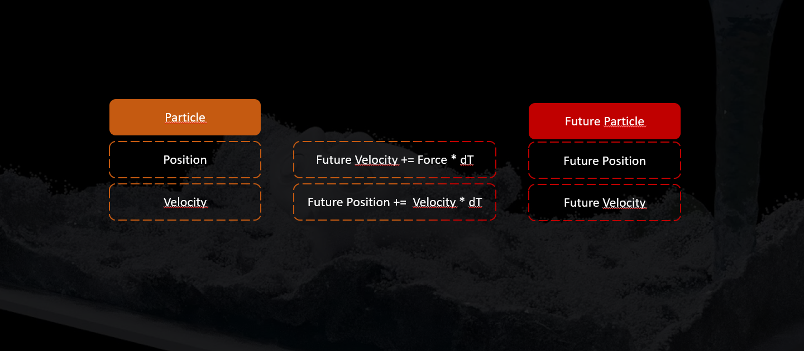

#  Smoothed Particle Hydrodynamics 

> Water can flow or it can crash. Be water, my friend - Bruce Lee

This repository is part of a project aiming to build an interactive biophysical simulation of <i>C. Elegans</i> and its locomotion behaviour. And especially, it's a great sandbox to unite a passion for neurobiology, biophysics, computer graphics and film :-).  

Here we toyed around with a lagrangian, particle-based simulation technique for fluids, which at some point should represent the liquid environment a virtual worm inhabits.

## Table of Contents

<ol>
<li>C. Elegans Connectomics</li>
<li>Applications of Smoothed Particle Hydrodynamics
<li>Introduction to SPH
<li>Implementation overview
<li>Results
<li> Further reading and sources
<li> Further resources
</ol>

## C. Elegans connectomics

<i>C. Elegans</i> is tiny. At about 1mm in length, 80 micrometers in diameter it lives its microscopic life in the moist environment rotting fruit or the soil. It is especially interesting to biologists, due to its constant cell size of 959 somatic cells, 300 of which comprise its nervous system, and 95 of which being the body wall muscles relevant for locomotion. 

These 300 neurons are capable of integrating sensory information from the exterior and interior and decide on which action our tiny worm will take, given the situation he finds himself in. 300 neurons, unlike the 86 000 000 000 neurons in humans, is a tiny number, still comprehensible to human minds. But despite this "reduced" nervous system <i>C. elegans</i> is capable of various behavioural programmes, which makes an interesting organism to study how a nervous system integrates information and decides on locomotor action.

Luckily, the nervous system has been mapped and studied for a long time, and since 1986 (see J, White; et al 1986) a map of all the neuronal connections is present. Of course, that sounds simpler than it actually is, but the point is that <i> Caenorhabditis Elegans</i> is the first and only animal of which a <b>full connectome </b> exists, and where it is comparatively feasible to study the connectome in detail. 

These leads to many exciting question to be asked in neurobiology, information science and even philosophy, but in light of increasingly powerful computers we're asking: Is it possible to simulate this system? Can we combine a virtual environment with a virtual body and a virtual nervous system? What could such a model tell us about the real deal? How reduced can and must such a virtual system be to still accurately capture real behaviour? Can this be turned into a tool to be used in close conjunction with <i>C. Elegans</i> experimentalists to aid prediction and generate new hypotheses?

Of course, over the past decades other researchers have wondered about this (eg. openworm.org or the <i>Si. Elegans</i>, roboticists etc.) and came up with very fascinating work. Yet the availability of powerful hardware and software for app and graphics development, as well as an abundance of learning resources for these tools gives access to computational methods to a greater audience, increasing the pool of people who can bring their knowledge and curiosity together to work on these problems.

So anyone who is still reading and curious, in the name of open science, feel free to collaborate or send me a message :-)

## The Matrix for Worms

As locomotive behaviour requires sensing the environment as well as interior states of the worms body we're trying to combine a simplified biophysical model of the worms body, e.g. a mass-spring-model with a particle-based simulation of its surrounding environment.

One simple observable locomotive behaviour in relation to the viscosity of the environment is forward and backwards locomotion. In viscous environments, like agar, the characteristic crawling motion pattern can be observed, whereas in less viscous environments, like water, swimming motions are displayed.

Both can be distinguished through the wavelengths of the body curvature traversing the body, as well as the beating frequency.

 

## Applications of SPH

 

 
 Originally developed to simulate processes in Astrophysics in the 1970s it gained popularity in computer graphics as a means to simulate the behaviour of fluids. It has been especially popular in the film, vfx and video game industries, as it enables the simulation of fluid behaviour in real-time.
 
 If you've seen <i>The Return of the King</i> you may remember Gollum drowning in a sea of lava after following the One ring to its doom. That lava simulation is based on the SPH algorithm.

As of 2024 new approaches exist of course, many based on SPH but with improvements to the original algorithm, leading to more accurate and stable simulation results. However, to get into interactive fluid simulations we thought it a good idea to start with the basics to get familiar with some of the concepts. 

 ## A brief introduction to SPH

 > I'm singing in the rain. Just singing in the rain. What a glorious feeling. I'm happy again - Gene Kelly
 
 In <i>Smoothed Particle Hydrodynamics</i> a fluid volume is discretized in a set of particles. These particles carry a <i>reference density, velocity, pressure </i> and <i>position</i>. 

 In each timestep of the simulation, each particles position is updated, by calculating estimating the density at the particles location and thus deriving the pressure. Then pressure forces and viscous forces acting on the particle are used to calculate the change in velocity, which then determines the new position at the next timestep. 

 
 

 So, for an SPH simulation as you can find it here, one needs two things:

 <ol>
 <li> A domain or grid</li>
 <li> A bunch of particles</li>
 </ol>

 
 

 The <i>domain</i> keeps the particles bounded and is divided into a set of grid cells. This is important to reduce the number of particles the algorithm has to compare during density estimation. In order to keep the particles within the domain the position of a particle is compared to the boundary dimensions, so for instance, if a particles' x-dimensions exceeds the x-dimension of the boundary, the particles x-position is reset, the velocity in that direction reversed and a damping factor applied, so that the particle loses energy upon bouncing off the wall.

 The <i>density</i> is measured by iterating over all the neighbouring particles within a Smoothing Radius (equal to the grid cell size) and summing up their local densities multiplied with a weighting factor depending on the distance to the particle of interest.
 
 For density estimation as well as the calculation of the pressure and viscous forces different <i> Smoothing Kernels</i> or their derivatives are applied. 
 
 One advantage of particle-based fluid simulation methods is, that they allow for parallel processing on the GPU. So instead of processing each particle in sequence (and you can get quite high numbers of particles in your simulation), you can process them in parallel simulataneously.

 Not surprisingly is the GPU or <i>Graphics Processing Unit</i> an integral part to computer graphics and is responsible for most of the things you see on your screen. If you want to see a green orb on screen, you take your geometric information (vertices and edges), describing the sphere and then you pass it to a <i>Shader</i>-script, describing <i>how</i> the Sphere should look like. Shaders most commonly use the GPU, where each pixel on the screen is processed in parallel.

 In Unity we can use that to move our particle simulation to the GPU as well, a so-called <i>Compute Shader</i>
 

 

 ## Implementation

  

  <ul>
  <li> Shaders (Billboard shader to render particles, particle shader and material)
  <li> Compute Shader Handling (Initialization and dispatch during update loop)
  <li> Particle system (simulation parameters, initialization of particles and SPH settings)
  <li> Compute Shader (SPH algorithm, in parallel for each particle, GPU)
  <li> GLLines, uses GLLines library to draw the bounding box in-game.
  </ul>
  

 ## Results

 

 
 Currently we got a basic interactive implementation of the SPH algorithm to run in Unity3D using ComputeShaders and GPU processing. It is still a little buggy, yet the domain can be moved, rotated, squished or made larger with the fluid behaving accordingly.
 
 In the following images you can see it in action. The animations you see are not pre-rendered but captured in real-time on a Windows PC and a Nvidia GeForce RTX 2080 GPU

 
 

 
 
 
 

 
 In future, we'd like to add physical bodies interacting with the fluid, namely a mass-spring-representation of a worms' body, like in previous works by Palyanov et. al (2012), but adapted to an interactive environment 

 

 ## Further Reading
 
 SPH in astrophysics, R.A. Gingold, J.J Monaghan

 <b>R. A. Gingold, J. J. Monaghan, Smoothed particle hydrodynamics: theory and application to non-spherical stars, Monthly Notices of the Royal Astronomical Society, Volume 181, Issue 3, December 1977, Pages 375–389, https://doi.org/10.1093/mnras/181.3.375</b>

 Paper on SPH in interactive applications by Matthias Müller:

 <b>Matthias Müller, David Charypar, and Markus Gross. 2003. Particle-based fluid simulation for interactive applications. In Proceedings of the 2003 ACM SIGGRAPH/Eurographics symposium on Computer animation (SCA '03). Eurographics Association, Goslar, DEU, 154–159.</b>

## Other ressources

In case you're interested in computer graphics and simulations, Matthias Müller hosts a series of short video lectures on the principles and implementation of various simulation techniques.

>https://matthias-research.github.io/pages/tenMinutePhysics/index.html

Also, heres a pretty cool video by Sebastian Lague on the simulation of fluids. Here he deals with the implementation of SPH as well.

> https://www.youtube.com/watch?v=rSKMYc1CQHE

 
